---
# Architecture
---

+ 기본적으로 Alluxio는 하나의 primary master, 다수의 worker로 구성 (Alluxio Server)
+ 크게 3개의 components로 구성: master, worker, client
	+ **master, workers**: Alluxio서버 - 유지보수/관리를 하는 system admin 역할
	+ **clients**: application(such as Spark, MR jobs, FUSE layer)에 위치하며 Alluxio 서버와 통신을 가능케 한다. 

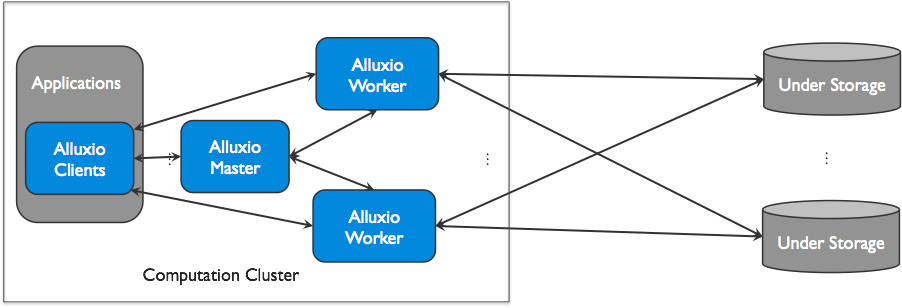

 
## Master
primary master와 여러개의 standby master(for fault tolerance)로 구성. 
primary master 다운되면, standby master중 하나가 **leader master**(primary master)가 됨 

+ 간략 정리
	1. 통합된 namespace 유지 (ex: file system tree)
	2. 사용가능한 worker에 대해 지속적 기록/관찰

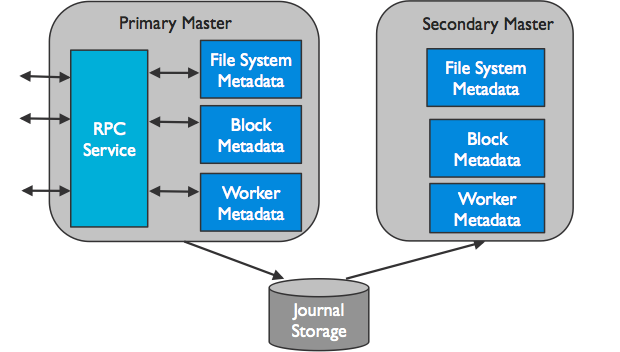

**Primary Master**

+ 전체 system의 metadata를 전체적으로 관리  
	(ex: file system metadata, block metadata, workers metatadata)
+ client는 metatdata를 읽고 변경하기 위해 leader master랑 의사소통
+ 모든 worker는 주기적으로 heartbeat정보를 primary master에게 보낸다. 
	(클러스터에서 worker의 참여를 유지하기 위해)

**Standby Master**

+ standby master는 
	1. primary master가 작성한 journal을 재생한다. (journal: alluxio가 metadata operation을 유지하기 위한 것)
	2. 주기적으로 
	3. 빠른 recovery를 위해 checkpoint를 쓴다.
	 
+ periodically squashes the journal entires
+ writes checkpoints for faster recovery in the future
+ it does not process any requests from any Alluxio components

  

## Worker
+ alluxio에 할당된 user-configurable local resources를 관리한다. (memory, ssd, hdd .. etc)
+ alluxio worker는 data를 block의 형태로 저장한다.
+ worker는 local resource를 포함한 새로운 block을 만들고 읽음으로써 data를 읽고 쓰기위한 client request를 다룬다. 
	(workers serve client requests that read or write data by reading or creating new blocks within its local resources.)
+ worker는 block안에 있는 data만을 책임진다. (file과 block의 실제 mapping은 master에만 저장 된다.)
+ Alluxio worker는 under store에서 data operation을 수행한다.
	- 중요포인트:	
		1. under store로부터 읽은 data는 worker에 저장되고 다른 client의 data를 즉시 사용이 가능하다.
		2. client can be lightweight 그래서, under storage connector의 영향을 받지 않는다.  

+ 간략 정리
	1. Manage local resource
	2. Store chunk of data
	3. fetch data from underlying physical storage
	4. respond to client request
	5. report heartbeat to the master 

RAM은 제한적이기 때문에 worker에 있는 block은 공간이 full일때, 방출된다. worker는 eviction policies(방출정책?)에 따라 Alluxio space를 유지한다.
  
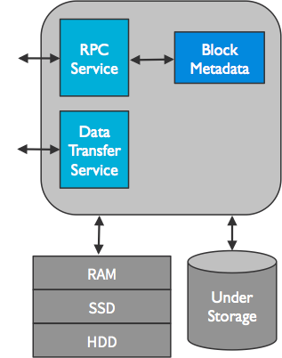

  

## Client
+ Alluxio client는 Alluxio server와 의사소통하기 위한 gateway를 user에게 제공한다.
+ client는 metadata operation을 수행하기 위해 primary master와 의사소통 한다.
+ client는 alluxio에 저장된 data를 읽고 쓰기 위해 worker와 의사소통 한다.
+ client는 native filesystem api in java를 제공하고 다양한 client language(REST, go, + python)을 서포트한다.
+ alluxio는 HDFS API와 Amazon S3 API와 호환이 되는 API를 지원한다.

    

---
# Features
---

 
## Journal
+ Alluxio는 metadata operation을 위해 journal을 유지한다.
+ 가장 중요한 journal config 
	
	~~~
	alluxio.master.journal.folder=[namenodeserver]:[namenodeport]/dir/
	alluxio_journal
	~~~
	
+ Alluxio가 처음 구동될때, journal은 반드시 format되어야 한다.
 
	~~~
	bin/alluxio formatMaster
	~~~ 
	
+ Alluxio는 metadata가 이전 시점으로 되돌리기위해 journal backup을 지원한다.

	~~~
	## default backup이름: alluxio-journal-YYYY-MM-DD-timestamp.gz
	bin/alluxio fsadmin backup
	
	## config for backup directory
	alluxio.master.backup.directory=/alluxio/backups
	~~~
	
+  journal backup으로 부터 alluxio system을 복원하기 위해, 시스템을 restart해야하고, 재시작 시, "-i" flag와 함께 URL 추가 입력

	~~~
	bin/alluxio-stop.sh masters
	bin/alluxio formatMaster
	bin/alluxio-start.sh -i <backup_uri> masters
	## ex) hdfs://[namenodeserver]:[namenodeport]/alluxio_backups/alluxio-journal-YYYY-MM-DD-timestamp.gz
	
	## restore 성공 log 메세지
	INFO AlluxioMasterProcess - Restored 57 entries from backup
	~~~

  
## Alluxio Storage
+ Alluxio는 분산버퍼캐쉬같은 역할을 하는 alluxio worker의 memory를 가지고 있는 local storage를 관리한다.
+ user configuration에 의해 각 node의 storage 크기와 타입이 정해진다.
+ Alluxio는 L1/L2 cpu cache같은 data storage 최적화를 가능하케하는 system storage media를 인식하는 tiered storage를 지원한다.

### configuration

### Eviction

### Evictors

### Tiered Storage(

        

---
## 정리
+ Decoupling
	+ physical storage로 부터 app 분리 가능
	+ app은 alluxio와의 연결만 있으면 되고, 자동으로 alluxio로 부터 지원되는 physical storage를 지원한다.
	+ Alluxio가 다양한 인터페이스를 제공함(HDFS, key/value, file system interface)으로 간단하게 통합할 수 있다.
+ Speed
	+ Alluxio는 app과 physical storage에 위치해 있고, 실제 storage에서 data를 가져오는 것처럼, in-memory에 data를 저장 할수 있고 가져올 수도 있다.
	+ Alluxio는 메모리 뿐만 아니라 SSD 및 Disk를 위한 계층형 스토리지도 지원한다.

+ Names
	+ 통합 이름 지정은 실제로 디스크와 호스트를 파일 시스템에 마운트하는 것과 같은 방식으로 작동합니다.
		+ alluxio://hostname:port
		+ hdfs://hostname:port
		+ s3n://hostname:port

    

---
# Data Flow in Alluxio
---
기본적인 Alluxio의 동작에 대한 설명 (read, write)

## Data Read
Alluxio는 under storage와 computation framework사이에서 data reads를 위한 Caching layer 역할을 한다. 

### Local Cache Hit
+ requested data가 local Alluxio worker에 있을때 일어난다. (computation은 local cache hit을 얻는다.)
+ application이 Alluxio client를 통해 data access 요청할때, client는 Alluxio master와 함께 data의 worker 위치를 체크한다.
+ 만약, data available in local, Alluxio client는 Alluxio worker를 통과하기 위해 **short-circuit read**를 사용하고, local filesystem에서 직접 file을 읽는다.
+ short-circuit read는 TCP소켓을 통한 data transfer를 회피하고, memory speed의 data access를 제공한다.
+ Short-circuit는 Alluxio에서 data를 읽기 위한 가장 효과적인 방법이다.
+ 기본적으로, short-circuit read는 허용된 permission을 요구하는 local filesystem operation을 사용한다.
+ 때때로, worker와 client가 dockerize될때 불가능하다. (부정확한 resource acccounting 때문)
+ short circuit이 불가능할때, Alluxio는 worker가 미리 디자인된 domain socket path를 통해 data를 client에게 전달하기위해 short circuit에 위치한 domain socket을 제공한다. 
	[Running Alluxio on Docker.](https://github.com/nodeca/babelfish/)

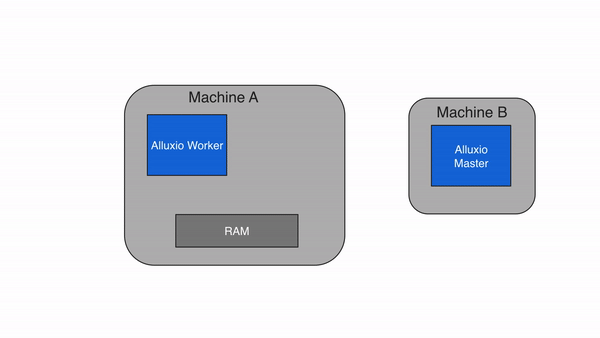

 

### Remote Cache Hit
+ data가 local Alluxio worker에서 없고 cluster상에서 다른 Alluxio worker에 위치한다면, Alluxio client는 다른 머신의 worker로 부터 data를 읽는다.
+ client는 master에서 확인하고, remote worker로 부터 data가 가능한지를 찾는다. 
+ local worker는 remote worker로부터 data를 읽고, client에게 data를 넘긴다.
+ worker는 또한 copy를 로컬에 쓰며 이후 같은 data를 read할때 memory에서 local로 제공 된다.
+ Remote Cache hit은 network-speed의 data read를 제공한다.
+ Alluxio는 under storage보다 remote worker를 먼저 읽는 것을 우선순위로 한다. 왜냐면 worker와 under storage사이의 속도보다 더 빠르기 때문 
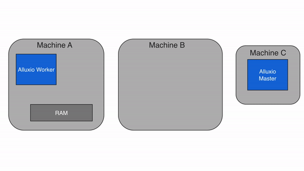

### Cache Miss
+ Alluxio내에서 data호출이 불가능 할때.
+ client는 읽기 작업을 local worker에게 넘기고 그 worker는 under storage에서 데이터를 읽는다.
+ worker는 차후 read 작업을 위해, data를 local 메모리에 저장하고 관련 정보를 client에 전달한다.
+ 주로 data를 처음 읽을 때 cache miss가 발생한다.

## Caching
### Partial Caching
+ Property 설정: [alluxio.user.file.cache.partially.read.block](https://www.alluxio.org/docs/master/en/Configuration-Properties.html#alluxio.user.file.cache.partially.read.block) to false.
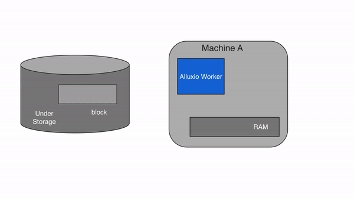
### No Caching
+ Alluxio caching을 끄고, client가 under storage에서 직접 data를 읽는다. 
	(property 설정: [alluxio.user.file.readtype.default](https://www.alluxio.org/docs/master/en/Configuration-Properties.html#alluxio.user.file.readtype.default) in the client to NO_CACHE)	

## Data Write
Alluxio API 또는 client에 있는 property 설정([alluxio.user.file.writetype.default](https://www.alluxio.org/docs/master/en/Configuration-Properties.html#alluxio.user.file.writetype.default))을 통해 write type이 결정된다.
### MUST_CACHE (default)
+ write type 중 MUST_CACHE는 기본값이며 Alluxio Client는 local worker에만 쓴다. (under storage에는 쓰지 않는다.)
+ 쓰기전에 client는 master에 metadata를 만들고, 빠른 쓰기가 가능하다. 
+ client는 local RAM disk에 있는 파일에 직접 쓴다 (속도를 느리게 하는 network transfer를 피하기 위해 worker를 우회한다.) -->  short-circuit write (memory speed 실행가능)
+ under storage에 data가 쓰여지지않은 상태에서 기기에러나 새로운 쓰기를 위한 free-up이 필요해지면, 데이터손실을 가져올 수 있다.

### CACHE_THROUGH
+ Alluxio worker와 under storage에 data가 동기화 된다.
+ client는 write 작업을 하기위해 local worker을 대리자로 지정하고, 그 worker는 local memory와 under storage에 동시에 쓴다.
+ 당연히 local storage보다 under storage에 쓰는게 훨씬 느림
+ client의 write speed는 under storage의 write speed와 같다.
+ CACHE_THROUGH는 data 보관을 위해 필요한 추천 write type이다.

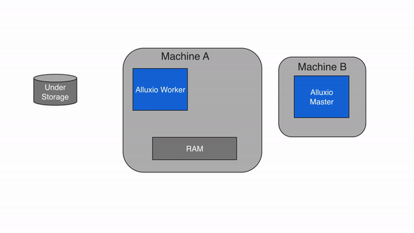
### ASYNC_THROUGH
+ ASYNC_THROUGH는 실험적인 write type
+ data가 동기로 alluxio worker에 쓰여지고, 비동기로 under storage에 쓰여진다.
+ data가 살아 있는 동안, data는 memory speed로 계속적으로 쓰여진다.
+ AYNC_THROUGH는 실험적인 feature로써, 몇가지 제한이 있다.
	1. data가 under storage에 비동기로 저장되기 전에 machine 충돌이 발생하면 손실이 발생한다.
	2. 모든 block은 같은 worker에 반드시 머물러야 한다.

    

---
# Storage Unification and Abstraction
---

+ bigdata의 발전으로 많은 양의 data가 여러 회사에서 제공하는 다른 형태의 storage system에 저장된다. 여기서 문제는, 효율적인 측면에서 data의 통합연결된 view를 보기는 매우 힘들다.
+ Data Lake를 구축하는게 흔한 해결책이지만, data를 영구적으로 보관하려면, 많은 비용이 든다.
+ Alluxio의 Unified namespace feature를 통해, 다른 시스템에 접근을 용이하게 하고, computation framework와 under storage에 끊어짐 없는 연결을 가능케 한다.
+ Application은 under storage에 저장된 data에 접근하기위해 Alluxio하고만 통신한다.
+ Alluxio는 각기 다른 데이터 소스로 부터 모든 data의 통합적인 view를 제공하는 마치 "virtual data lake"와 같다. (not creating permanet copies of that data)

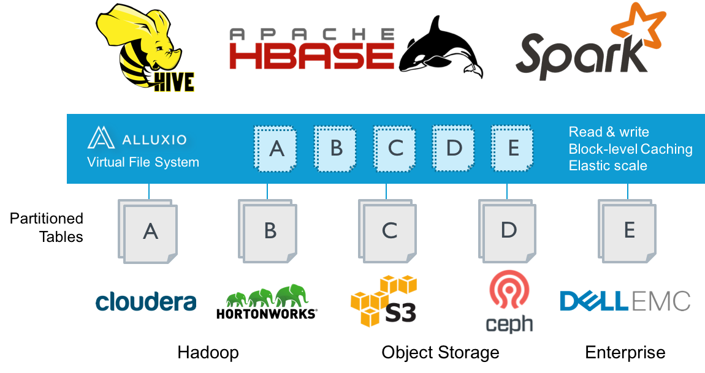

##### "Virtual data lake"로써 사용되는 Alluxio의 장점
+ Unified access
	+ App은 모든 data를 위해 single system과 single namespace하고만 통신한다.
	+ App은 다른 system이 어떻게 data에 접근하는지 신경쓸 필요 없다.
+ No ETL
	+ Alluxio는 요구가 있을때만 존재하는 storage system으로부터 데이터를 pull한다.
+ Configuration Management
	+ 
+ Modern, flexible architecture
	+ alluxio unified namespace는 storage로부터 computing의 분리를 돕는다.
	+ 이런 타입의 architecture는 최신의 데이터 처리를 위한 resource의 더 큰유연함을 가능케 한다.
+ storage API Independence
	+ Alluxio는 HDFS, S3와 같은 common storage interface를 지원한다.
	+ Alluxio unified namespace를 사용해, Application은 Source data의 API와 무관하게 원하는 interface를 통해 모든 data에 접근 할 수 있다.
+ Performance
	+ local caching과 eviction strategy는 중요하고 자주사용되는 data에 빠른 local access를 제공한다. (w/o permanent copies of data)

    

---
# Remote Data Acceleration
---

+ coupled compute-storage arcitecture는 compute엔진이 가까운 곳에서 data를 가져올 수 있게해준다. 하지만 이 architecture를 유지하고 관리하는 데 드는 비용이 점차 performance 이점을 넘어서고 있다.
+ 특히, cloud 사용이 보편화 되면서, 많은 비용 절감과 더욱 저렴한 유지보수 비용이 중요시 되고 있다.
+ application 또는 compute framework는 alluxio에게만 request를 보내고, alluxio는 remote storage로 부터 data를 가져온다.

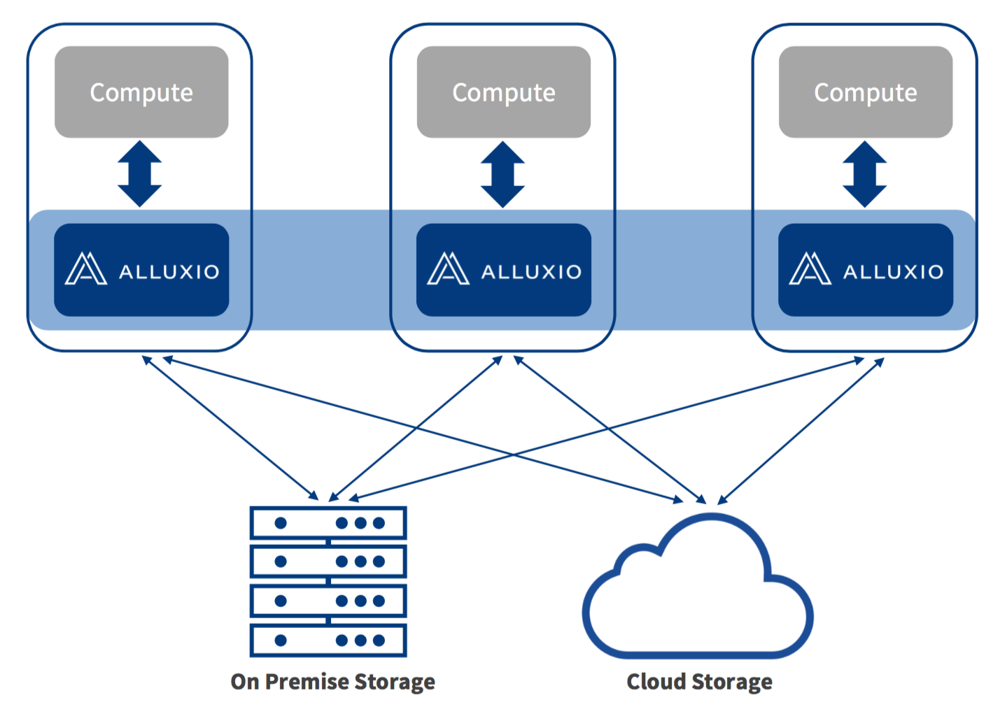

    

---
# Quick Start
---

### 1. Alluxio 다운로드
www.alluxio.org/download 
본인이 원하는 alluxio 버전과 빌트인 hadoop 선택 후 다운로드 
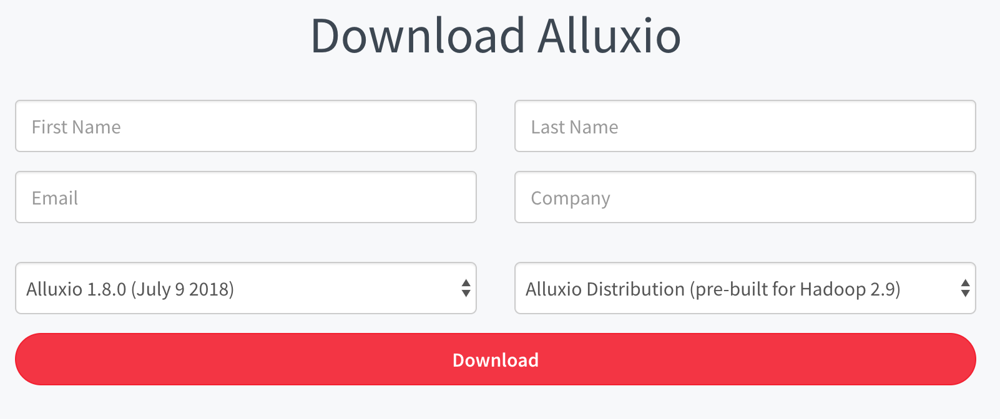

~~~
# 직접 다운로드
wget http://alluxio.org/downloads/files/{{site.ALLUXIO_RELEASED_VERSION}}/alluxio-{{site.ALLUXIO_RELEASED_VERSION}}-bin.tar.gz

ex)
http://downloads.alluxio.org/downloads/files/1.8.0/alluxio-1.8.0-hadoop-2.9-bin.tar.gz
~~~
	

### 2. Alluxio Config 수정
기본 configuration 수정 (로컬 환경이므로 hostname을 localhost로 정의)

~~~
alluxio.master.hostname=localhost
~~~

### 3. Alluxio 환경 검증
환경에 따라 선택 실행

~~~
# for local
./bin/alluxio validateEnv local 

# for cluster
./bin/alluxio validateEnv all   

# 특정 validation만 실행
./bin/alluxio validateEnv local ulimit
~~~

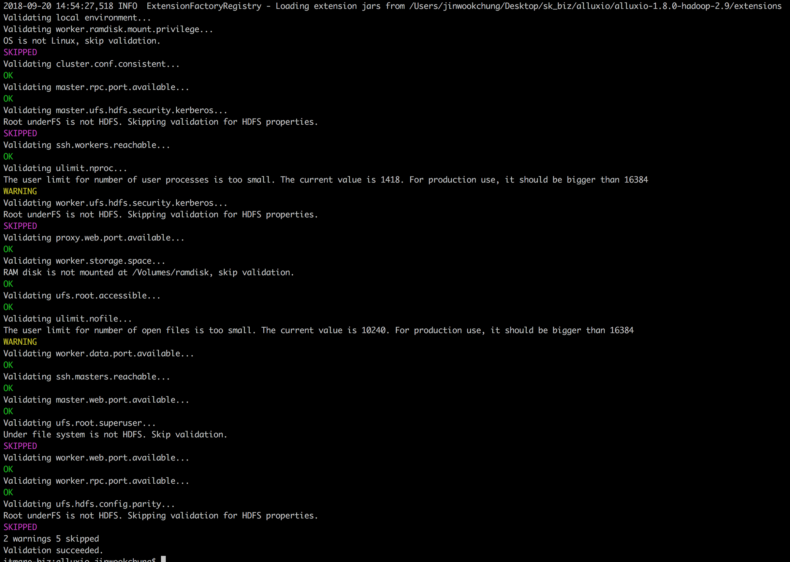

### 4. Alluxio 시작
master와 worker를 시작 준비를 위해 journal, worker storage directory 포맷 

~~~
./bin/alluxio format
~~~

Alluxio 시작

~~~
./bin/alluxio-start.sh local SudoMount
~~~

### 5. Alluxio shell 사용하기
([command line 리스트] (https://www.alluxio.org/docs/1.8/en/Command-Line-Interface.html)
)

~~~
## Alluxio file system 기본 명령어
./bin/alluxio fs [option]

예제)
## 로컬에 있는 LICENSE 파일을 alluxio로 복사
./bin/alluxio fs copyFromLocal LICENSE /LICENSE 

## alluxio의 해당 디렉토리 파일 리스트업
./bin/alluxio fs ls /

## alluxio에 있는 파일을 Under Storage에 저장
./bin/alluxio fs persist /LICENSE
~~~

예제 결과 
alluxio fs에 있는 파일 LICENSE가 NOT_PERSIST에서 PERSIST로 변경된걸 확인 할 수 있다. 
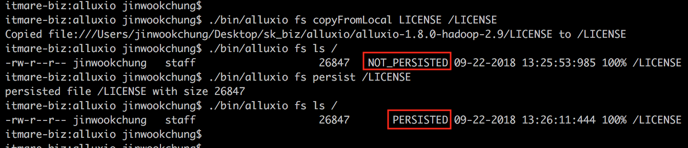

    

---
# Alluxio on Local Machine
---
### 1. Requirement
	+  Java (JDK 8 이상)
	+  conf/alluxio-site.properties (from conf/alluxio-site.properties.template)
	+  conf/alluxio-site.properties 수정
		+  alluxio.master.hostname=localhost
		+  alluxio.underfs.address=[desired_directory]
	+  passwordless ~/.ssh/authorized_keys   ([링크](http://www.linuxproblem.org/art_9.html))

### 2. Alluxio Filesystem 포맷
+ 처음 Alluxio를 실행했을때만 필요 (존재한 Alluxio 클러스터가 있을때 실행하면 Alluxio filesystem에 있는 이전에 저장된 모든 data와 metadata가 지워진다. (Not under storage)

~~~
./bin/alluxio format
~~~

### 3. Local Alluxio Filesystem 시작
~~~
### root 또는 local 다음에 SudoMount 붙여서 실행해야함
./bin/alluxio-start.sh local
~~~
*** 상위 command는 RAMFS설정을 위한 sudo 권한을 얻기 위해 input password가 필요, Alluxio filesystem은 in-memory data storage로써 [RAMFS](https://www.kernel.org/doc/Documentation/filesystems/ramfs-rootfs-initramfs.txt)을 사용한다. 

### 4. Alluxio running 확인 및 정지
http://localhost:19999 접속해서 확인 or logs dir확인

~~~
# 테스트
./bin/alluxio runTests
# 정지
./bin/alluxio-stop.sh local
~~~

### 5. sudo 권한 실행
- Linux에선 Alluxio를 시작하기 위해/mount를 실행하기위해 sudo권한이 필요, RAMFS을 in-memory data storage로 사용한다. 
	(추가자료: [ramdisk vs. ramfs vs. tmpfs](http://hoyoung2.blogspot.com/2012/02/ramdisk-ramfs-tmpfs.html))

- 만약 sudo 권한이 없으면, 이미 system admin으로부터 마운트된 그리고 읽기/쓰기가 가능한 user가 접근가능한 RAMFS가 필요하다. alluxio-site.properties에서 다음 conf 수정

~~~
alluxio.worker.tieredstore.level0.alias=MEM
alluxio.worker.tieredstore.level0.dirs.path=/path/to/ramdisk

## 그리고 data storage로써 위의 directory를 사용하기 위해 "NoMount" option과 함께 Alluxio 시작
./bin/alluxio-start.sh local NoMount
~~~

    

---
# Alluxio on Cluster
---

1. master로 사용할 노드의 con/falluxio-site.properties 변경

	~~~
	alluxio.master.hostname=[master_node_address]
	~~~

2. conf/workers에 모든 worker노드의 ip address 또는 hostname 추가

	~~~
	## worker들의 conf 경로에 복사하기
		./bin/alluxio copyDir <dirname>  
	~~~
	
3. 노드가 통신 위해 passwordless 설정 [(링크)](http://www.linuxproblem.org/art_9.html)
4. alluxio 준비 / 시작

	~~~
	./bin/alluxio format
	./bin/allxuio-start.sh <옵션1> <옵션2>
	~~~
	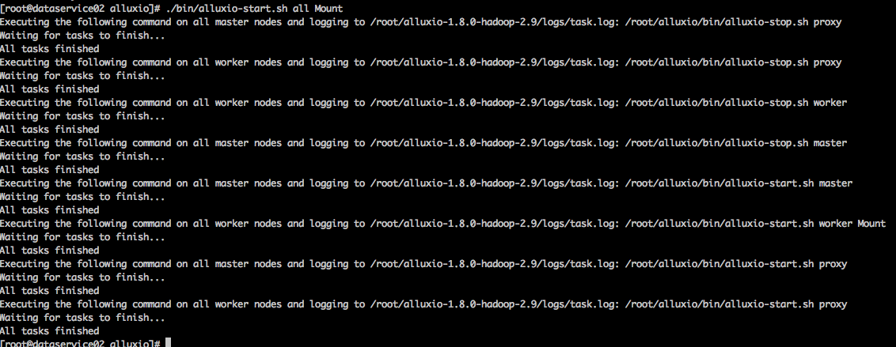

    

---
# Alluxio on Docker
---

    

---
# Command Line Interface
---
| Option | Description |
| ------ | ----------- |
| hello | world

    

---
# Check Error
---

### Inconsistent Files on Startup 

~~~
## List each inconsistent file or directory
./bin/alluxio fs checkConsistency /

## Repair the inconsistent files or directories
./bin/alluxio fs checkConsistency -r /
~~~

