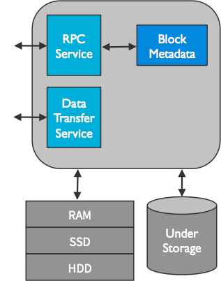
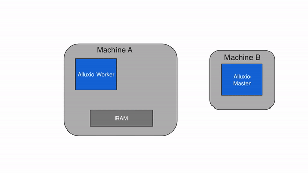
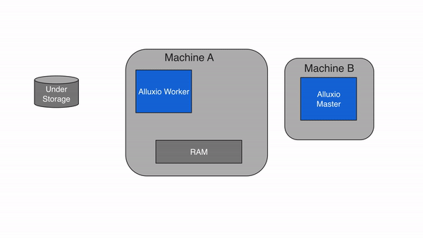
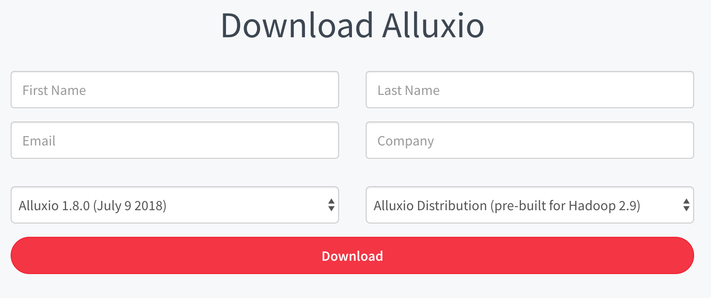
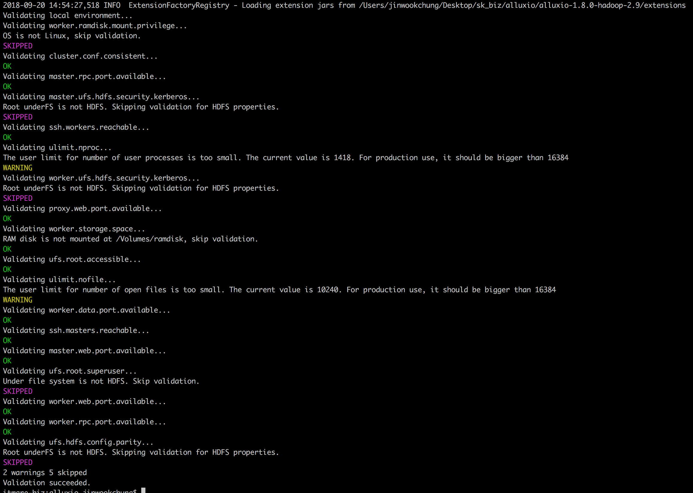
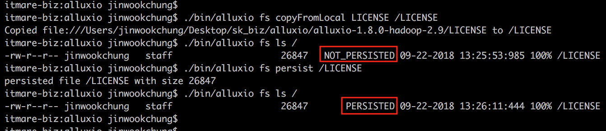

Alluxio 정리 중

---

Architecture
============

---

-	기본적으로 Alluxio는 하나의 primary master, 다수의 worker로 구성 (Alluxio Server)
-	크게 3개의 components로 구성: master, worker, client
	-	**master, workers**: Alluxio서버 - 유지보수/관리를 하는 system admin 역할
	-	**clients**: application(such as Spark, MR jobs, FUSE layer)에 위치하며 Alluxio 서버와 통신을 가능케 한다.


Master
------

primary master와 여러개의 standby master(for fault tolerance)로 구성.  
primary master 다운되면, standby master중 하나가 **leader master**(primary master)가 됨

-	간략 정리
	1.	통합된 namespace 유지 (ex: file system tree)
	2.	사용가능한 worker에 대해 지속적 기록/관찰


**Primary Master**

-	전체 system의 metadata를 전체적으로 관리<br> (ex: file system metadata, block metadata, workers metatadata)
-	client는 metatdata를 읽고 변경하기 위해 leader master랑 의사소통
-	모든 worker는 주기적으로 heartbeat정보를 primary master에게 보낸다. (클러스터에서 worker의 참여를 유지하기 위해)

**Standby Master**

-	standby master는
	1.	primary master가 작성한 journal을 재생한다. (journal: alluxio가 metadata operation을 유지하기 위한 것)
	2.	주기적으로
	3.	빠른 recovery를 위해 checkpoint를 쓴다.
-	periodically squashes the journal entires
-	writes checkpoints for faster recovery in the future
-	it does not process any requests from any Alluxio components

<br><br>

Worker
------

-	alluxio에 할당된 user-configurable local resources를 관리한다. (memory, ssd, hdd .. etc)
-	alluxio worker는 data를 block의 형태로 저장한다.
-	worker는 local resource를 포함한 새로운 block을 만들고 읽음으로써 data를 읽고 쓰기위한 client request를 다룬다.<br> (workers serve client requests that read or write data by reading or creating new blocks within its local resources.)
-	worker는 block안에 있는 data만을 책임진다. (file과 block의 실제 mapping은 master에만 저장 된다.)
-	Alluxio worker는 under storage에서 data operation을 수행한다.

	-	중요포인트:

		1.	under storage로부터 읽은 data는 worker에 저장되고, client는 data를 즉시 사용이 가능하다.
		2.	client can be lightweight 그래서, under storage connector의 영향을 받지 않는다.

-	간략 정리

	1.	해당 local resource 관리
	2.	data를 저장
	3.	under storage에서 data 가져옴
	4.	client의 요청에 응답
	5.	master에게 heartbeat를 주기적으로 리포트

RAM은 제한적이기 때문에 worker에 있는 block은 공간이 full일때, 방출된다. worker는 eviction policies(방출정책)에 따라 Alluxio space를 유지한다.



<br><br>

Client
------

-	Alluxio client는 Alluxio server와 의사소통하기 위한 gateway를 user에게 제공한다.
-	client는 metadata operation을 수행하기 위해 primary master와 의사소통 한다.
-	client는 alluxio에 저장된 data를 읽고 쓰기 위해 worker와 의사소통 한다.
-	client는 native filesystem api in java를 제공하고 다양한 client language(REST, go, + python)을 서포트한다.
-	alluxio는 HDFS API와 Amazon S3 API와 호환이 되는 API를 지원한다.

<br><br>

정리
----

-	**Decoupling**
	-	physical storage로 부터 app 분리 가능
	-	app은 alluxio와의 연결만 있으면 되고, 자동으로 alluxio로 부터 지원되는 physical storage를 지원한다.
	-	Alluxio가 다양한 인터페이스를 제공함(HDFS, key/value, file system interface)으로 간단하게 통합할 수 있다.
-	**Speed**
	-	Alluxio는 app과 physical storage에 위치해 있고, 실제 storage에서 data를 가져오는 것처럼, in-memory에 data를 저장 할수 있고 가져올 수도 있다.
	-	Alluxio는 메모리 뿐만 아니라 SSD 및 Disk를 위한 계층형 스토리지도 지원한다. 
-	**Names**
	-	Unified naming은 실제로 disk를 file system에 마운트하는 것과 같은 방식으로 작동한다.
		-	alluxio://hostname:port
		-	hdfs://hostname:port
		-	s3n://hostname:port  

<br><br><br>

<br>

---

Data Flow in Alluxio
====================

---

기본적인 Alluxio의 동작에 대한 설명 (read, write)

Data Read
---------

Alluxio는 under storage와 computation framework사이에서 data reads를 위한 Caching layer 역할을 한다.

### Local Cache Hit

-	**data의 위치가 worker의 위치와 같을때**
-	requested data가 local Alluxio worker에 있을때 일어난다. (computation은 local cache hit을 얻는다.)
-	application이 Alluxio client를 통해 data access 요청할때, client는 Alluxio master와 함께 data가 있는 worker 위치를 체크한다.
-	data가 local에 위치한다면, Alluxio client는 Alluxio worker를 지나치기 위해 short-circuit read를 사용하고, local filesystem(RAM)에서 직접 file을 읽는다.
-	short-circuit read는 TCP소켓을 통한 data transfer를 회피하고, memory speed의 data access를 제공한다.
-	Short-circuit는 Alluxio에서 data를 읽기 위한 가장 효과적인 방법이다.
-	기본적으로, short-circuit read는 허용된 permission을 요구하는 local filesystem operation을 사용한다.
-	때때로, worker와 client가 dockerize될때 불가능하다. (부정확한 resource acccounting 때문)
-	short circuit이 불가능할때, Alluxio는 worker가 미리 디자인된 domain socket path를 통 data를 client에게 전달하기위해 short circuit에 위치한 domain socket을 제공한다.<br>[Running Alluxio on Docker.](https://github.com/nodeca/babelfish/)



### Remote Cache Hit

-	**data의 위치가 local worker에 없고, 다른 worker에 있을때**
-	data가 local Alluxio worker에서 없고 cluster상에서 다른 Alluxio worker에 위치한다면, Alluxio client는 다른 머신의 worker로 부터 data를 읽는다.
-	client는 master에서 확인하고, remote worker로 부터 data가 가능한지를 찾는다.
-	local worker는 remote worker로부터 data를 읽고, client에게 data를 넘긴다.
-	worker는 또한 copy를 로컬에 쓰며 이후 같은 data를 read할때 memory에서 local로 제공 된다.
-	Remote Cache hit은 network-speed의 data read를 제공한다.
-	Alluxio는 under storage보다 remote worker를 먼저 읽는 것을 우선순위로 한다. 왜냐면 worker와 under storage사이의 속도보다 더 빠르기 때문


### Cache Miss

-	Alluxio내에서 data호출이 불가능 할때.
-	client는 읽기 작업을 local worker에게 넘기고 그 worker는 under storage에서 데이터를 읽는다.
-	worker는 차후 read 작업을 위해, data를 local 메모리에 저장하고 관련 정보를 client에 전달한다.
-	주로 data를 처음 읽을 때 cache miss가 발생한다.


Data Write
----------

Alluxio API 또는 client에 있는 property 설정([alluxio.user.file.writetype.default](https://www.alluxio.org/docs/master/en/Configuration-Properties.html#alluxio.user.file.writetype.default))을 통해 write type이 결정된다.

### MUST_CACHE (default)

-	write type 중 MUST_CACHE는 기본값이며 Alluxio Client는 local worker에만 쓴다. (under storage에는 쓰지 않는다.)
-	쓰기전에 client는 master에 metadata를 만들고, 빠른 쓰기가 가능하다.
-	client는 local RAM disk에 있는 파일에 직접 쓴다 (속도를 느리게 하는 network transfer를 피하기 위해 worker를 우회한다.) --> short-circuit write (memory speed 실행가능)
-	under storage에 data가 쓰여지지않은 상태에서 기기에러나 새로운 쓰기를 위한 free-up이 필요해지면, 데이터손실을 가져올 수 있다.



### CACHE_THROUGH

-	Alluxio worker와 under storage에 data가 동기화 된다.
-	client는 write 작업을 하기위해 local worker을 대리자로 지정하고, 그 worker는 local memory와 under storage에 동시에 쓴다.
-	당연히 local storage보다 under storage에 쓰는게 훨씬 느림
-	client의 write speed는 under storage의 write speed와 같다.
-	CACHE_THROUGH는 data 보관을 위해 필요한 추천 write type이다.


### ASYNC_THROUGH

-	ASYNC_THROUGH는 실험적인 write type
-	data가 동기로 alluxio worker에 쓰여지고, 비동기로 under storage에 쓰여진다.
-	data가 살아 있는 동안, data는 memory speed로 계속적으로 쓰여진다.
-	AYNC_THROUGH는 실험적인 feature로써, 몇가지 제한이 있다.
	1.	data가 under storage에 비동기로 저장되기 전에 machine 충돌이 발생하면 손실이 발생한다.
	2.	모든 block은 같은 worker에 반드시 머물러야 한다.


Caching
-------

설정 config: alluxio.user.file.readtype.default=CACHE_PROMOTE(default), CACHE, NO\_CACHE [(참고)](https://www.alluxio.org/docs/master/en/Configuration-Properties.html#alluxio.user.file.readtype.default)

### default (CACHE_PROMOTE)

-	이미 alluxio storage에 data가 있는 경우, highest tier로 data를 이동시킨다.
-	data를 under storage에서 읽어야 할 경우, local alluxio의 highest tier에 data를 쓴다.

### Partial Caching (CACHE)

-	local system에서 block 읽는게 불가능 할때, client에 의해 block의 일부만 요청되도 local worker가 block을 읽고 캐쉬한다.
-	block에서 필요한 부분만 client에게 전달
-	1.7이전버전
	-	partial caching이 설정되어 있으면, client가 전체 block을 동시에 읽고 캐시하므로 블록이 local worker에 완전히 캐시 될 때까지 client의 읽기 작업을 기다려야한다.
	-	client는 읽기를 worker에게 위임하고, worker는 block의 시작부터 끝까지 읽은 후, local RAM Disk에 쓴다.
	-	그리고, worker는 client에 의해 요청된 block의 일부 data를 client에게 보낸다.
-	default가 on, off로 변경하려면 [alluxio.user.file.cache.partially.read.block](https://www.alluxio.org/docs/master/en/Configuration-Properties.html#alluxio.user.file.cache.partially.read.block)를 false 설정 

### No Caching (NO_CACHE)

-	Alluxio caching을 끄고, client가 under storage에서 직접 data를 읽는다.<br> (property 설정: [alluxio.user.file.readtype.default](https://www.alluxio.org/docs/master/en/Configuration-Properties.html#alluxio.user.file.readtype.default) in the client to NO_CACHE)  

<br><br><br><br>

---

Storage Unification and Abstraction
===================================

---

-	bigdata의 발전으로 많은 양의 data가 여러 회사에서 제공하는 다른 형태의 storage system에 저장된다. 여기서 문제는, 효율적인 측면에서 data의 통합연결된 view를 보기는 매우 힘들다.
-	Data Lake를 구축하는게 흔한 해결책이지만, data를 영구적으로 보관하려면, 많은 비용이 든다.
-	Alluxio의 Unified namespace feature를 통해, 다른 시스템에 접근을 용이하게 하고, computation framework와 under storage에 끊어짐 없는 연결을 가능케 한다.
-	Application은 under storage에 저장된 data에 접근하기위해 Alluxio하고만 통신한다.
-	Alluxio는 각기 다른 데이터 소스로 부터 모든 data의 통합적인 view를 제공하는 마치 "virtual data lake"와 같다. (not creating permanet copies of that data)


##### "Virtual data lake"로써 사용되는 Alluxio의 장점

-	Unified access
	-	App은 모든 data를 위해 single system과 single namespace하고만 통신한다.
	-	App은 다른 system이 어떻게 data에 접근하는지 신경쓸 필요 없다.
-	No ETL
	-	Alluxio는 요구가 있을때만 존재하는 storage system으로부터 데이터를 pull한다.
-	Configuration Management
	-	application과 storage들은 특별한 설정이 필요없다. Alluxio에만 접속
-	Modern, flexible architecture
	-	alluxio unified namespace는 storage로부터 computing의 분리를 돕는다.
	-	이런 타입의 architecture는 최신의 데이터 처리를 위한 resource의 더 큰유연함을 가능케 한다.
-	storage API Independence
	-	Alluxio는 HDFS, S3와 같은 common storage interface를 지원한다.
	-	Alluxio unified namespace를 사용해, Application은 Source data의 API와 무관하게 원하는 interface를 통해 모든 data에 접근 할 수 있다.
-	Performance
	-	local caching과 eviction strategy는 중요하고 자주사용되는 data에 빠른 local access를 제공한다. (w/o permanent copies of data)

<br><br><br><br>

---

Remote Data Acceleration
========================

---

-	coupled compute-storage arcitecture는 compute엔진이 가까운 곳에서 data를 가져올 수 있게해준다. 하지만 이 architecture를 유지하고 관리하는 데 드는 비용이 점차 performance 이점을 넘어서고 있다.
-	특히, cloud 사용이 보편화 되면서, 많은 비용 절감과 더욱 저렴한 유지보수 비용이 중요시 되고 있다.
-	application 또는 compute framework는 alluxio에게만 request를 보내고, alluxio는 remote storage로 부터 data를 가져온다.


<br><br><br><br><br>

---

Features
========

---

<br>

Journal
-------

-	Alluxio는 metadata operation을 위해 journal을 유지한다.
-	가장 중요한 journal config

	```shell
	alluxio.master.journal.folder=[namenodeserver]:[namenodeport]/dir/
	alluxio_journal
	```

-	Alluxio가 처음 구동될때, journal은 반드시 format되어야 한다.

	```shell
	bin/alluxio formatMaster
	```

-	Alluxio는 metadata가 이전 시점으로 되돌리기위해 journal backup을 지원한다.

	```shell
	# default backup이름: alluxio-journal-YYYY-MM-DD-timestamp.gz
	bin/alluxio fsadmin backup

	# config for backup directory
	alluxio.master.backup.directory=/alluxio/backups
	```

-	journal backup으로 부터 alluxio system을 복원하기 위해, 시스템을 restart해야하고, 재시작 시, "-i" flag와 함께 URL 추가 입력

	```shell
	bin/alluxio-stop.sh masters
	bin/alluxio formatMaster
	bin/alluxio-start.sh -i <backup_uri> masters
	# ex) hdfs://[namenodeserver]:[namenodeport]/alluxio_backups/alluxio-journal-YYYY-MM-DD-timestamp.gz

	# restore 성공 log 메세지
	INFO AlluxioMasterProcess - Restored 57 entries from backup
	```

<br><br><br><br>

Alluxio Storage
---------------

-	Alluxio는 분산버퍼캐쉬같은 역할을 하는 alluxio worker의 memory를 가지고 있는 local storage를 관리한다.
-	user configuration에 의해 각 node의 storage 크기와 타입이 정해진다.
-	Alluxio는 L1/L2 cpu cache같은 data storage 최적화를 가능하케하는 system storage media를 인식하는 tiered storage를 지원한다.

### configuration

-	local filesystem에 mount관련 (under storage에 mount관련 아님)
-	conf/alluxio-site.properties 에서 alluxio storage config 설정

-	default memory size는 전체 메모리에서 68.3% 할당

	```shell
	# if using 16 RAM and two 100 SSD
	alluxio.worker.memory.size=16GB,100GB,100GB
	```

-	multiple storage media 설정, 경로 설정이라고 보면 됨 (ramdisk, ssd 등)

	```shell
	alluxio.worker.tieredstore.level0.dirs.path=/mnt/ramdisk,/mnt/ssd1,/mnt/ssd2
	```

-	경로설정 후, short circuit oepration을 적용하기 위해, 경로에 대한 권한을 client user에게 줘야한다. (to read, write and execute on the path) 예를들어 alluxio service를 시작한 user와 같은 그룹에 있는 user에게 770과 같은 권한을 줘야 한다.

-	storage의 사이즈를 설정한다.

```shell
alluxio.worker.tieredstore.level0.dirs.quota=16GB,100GB,100GB
```

-	기본설정은 alluxio.worker.memory.size를 따라간다.

-	기본 Alluxio가 공급한 ramdisk 이외의 device를 사용할때, 할당량을 메모리 크기와 별도로 설정한다.

<br>

### 2.1 Eviction (메모리에서 데이터 방출)

-	비동기(asynchronous:default)와 동기(synchronous) 두가지 mode 존재
-	user는 async eviction을 다루는 space reserver를 가능/불가능하게 하며 두모드를 변경 할 수 있다.
-	eviction은 주기적으로 space reserver thread에 의존하는데, worker storage 사용량이 설정된 high watermark에 도달할때까지 기다린다.
-	그리고나서, 설정된 low watermark에 도착하면 eviction policy에 따라 data를 방출한다.

```shell
alluxio.worker.tieredstore.reserver.enabled=false

# 전체 storage 사이즈: 16 + 100 + 100 = 216 GB 일때
alluxio.worker.tieredstore.level0.watermark.high.ratio=0.9 # 216GB * 0.9 ~ 200GB
alluxio.worker.tieredstore.level0.watermark.low.ratio=0.75 # 216GB * 0.75 ~ 160GB
```

-	**Space Reserver**
	-	한 layer의 모든 space가 소비되기전에 각 storage에서 space의 일정부분을 예약한다.
	-	bursty write(한번에 집중적으로 소규모로 한번씩 쓰여짐)의 성능을 향상시키고, eviction이 write를 위해 지속적 space 공간 확보를 하기때문에, 속도를 느리게하는 연속 write에 대해 marginal performance gain(한계 성능 향상?)을 제공한다.
	-	space reservation이 tier 별 높은/낮은 한계선을 설정에 따라 실행된다.
	-	high watermark에 다다르면, background eviction process가 실행되 low watermark에 도달할때까지 space의 공간을 확보한다.

<br>

### 2.2 Evictors

-	evictor는 어떤 block을 방출할지 결정하고, 유저가 eviction 과정을 설정할 수 있다.
-	evictor는 커스텀이 가능하지만, 기본적으로 4가지의 evictor로 분류
	1.	**GreedyEvictor**: 임의의 block 방출
	2.	**LRUEvictor**: LRU block 방출
	3.	**LRFUEvictor**: LRU와 LFU에 가중치를 주고, 그에 따라 block 방출
	4.	**PartialLRUEvictor**: LRU를 기반으로 block 방출하지만, maximum free space를 가진 StorageDir를 선택하고, 그것만 방출한다.

\** LRU (Least Recently Used): 가장 오랫동안 사용 하지 않은 것<br>\** LFU (Least Frequently used): 사용빈도가 가장 적은 것 + 동기화된 eviction을 사용간에, block eviction의 latency를 줄이기 위해 block size를 작게 하는것을 추천(대략 64~128MB), space reserver를 사용할때 block size는 eviction latency에 영향을 받지 않는다.

<br>

### 3. Tiered Storage 사용

-	heterogeneous storage media와 함께 single storage tier를 사용하는 것을 추천
-	I/O 속도에 명시적으로 storage media를 주문하면 업무에 이익을 가져올 수 있다.
-	tier 종류: MEM, SSD, HDD

#### 3.1 Writing Data

-	기본적으로 top tier에 writing
-	top tier에서 공간을 못만들거나 파일 사이즈가 top tier의 사이즈를 초과하면, writing은 실패
-	user는 writing data에 대한 tier 설정을 할 수 있다. ([configuration setting](https://www.alluxio.org/docs/1.8/en/Alluxio-Storage.html#configuration-parameters-for-tiered-storage)\)
-	"ReadType.CACHE_PROMOTE"로 Reading data를 설정하면, data는 항상 top tier에 쓰여진다.

#### 3.2. Reading Data

-	ReadType.CACHE_PROMOTE는 우선적으로 data를 top tier로 보내진(hot data를 higher tier로 옮기기위한 data management strategy).

#### 3.3. Enabling & configuring Tiered Storage

예제) memory와 hdd를 가지고 2 tier alluxio를 설정할때,

```shell
alluxio.worker.tieredstore.levels=2 # alluxio의 tier를 2개로 설정
alluxio.worker.tieredstore.level0.alias=MEM # 첫번째(top) tier는 메모리로 설정
alluxio.worker.tieredstore.level0.dirs.path=/mnt/ramdisk    # 첫번째 tier의 파일 경로 설정
alluxio.worker.tieredstore.level0.dirs.quota=100GB  # 100gb로 memory 할당
alluxio.worker.tieredstore.level0.watermark.high.ratio=0.9  # 첫번째 tier에서 high watermark의 비율 설정
alluxio.worker.tieredstore.level0.watermark.low.ratio=0.7   # 첫번째 tier에서 low watermark의 비율 설정
alluxio.worker.tieredstore.level1.alias=HDD # 두번째 tier를 hdd로 설정
alluxio.worker.tieredstore.level1.dirs.path=/mnt/hdd1,/mnt/hdd2,/mnt/hdd3   # hdd를 3개의 나눠진 파일 경로로 설정
alluxio.worker.tieredstore.level1.dirs.quota=2TB,5TB,500GB  # 3개의 파일 경로에 각각 2tb,5tb,5gb로 용량 할당
alluxio.worker.tieredstore.level1.watermark.high.ratio=0.9  # 두번째 tier에서 high watermark의 비율 설정         
alluxio.worker.tieredstore.level1.watermark.low.ratio=0.7   # 두번째 tier에서 low watermark의 비율 설정
```

-	tier를 만드는 수는 제한이없지만 보통 3개의 tier로 설정 (mem, hdd, ssd)
-	많아야 하나의 tier가 특정한 alias를 참조할 수 있다. 예를들어 많아야 하나의 tier가 alias hdd를 가진다. 만약 HDD tier를 위해 다양한 하드드라이브를 alluxio에 사용한다면, 여러 path를 사용할 수있게 설정 해야 한다. (alluxio.worker.tieredstore.level{x}.dirs.path 변경)

참고: [Configuration Parameters For Tiered Storage](https://www.alluxio.org/docs/1.8/en/Alluxio-Storage.html#configuration-parameters-for-tiered-storage)<br><br><br><br>

<br><br><br><br>

Configuration Settings
----------------------

#### JVM system properties -Dproperty=value를 통해 Application config 적용

-	예시

	```shell
	# Alluxio Shell Command
	$ bin/alluxio fs -Dalluxio.user.file.writetype.default=CACHE_THROUGH copyFromLocal README.md /README.md
	# Spark Jobs
	$ spark-submit \
	--conf 'spark.driver.extraJavaOptions=-Dalluxio.user.file.writetype.default=CACHE_THROUGH' \
	--conf 'spark.executor.extraJavaOptions=-Dalluxio.user.file.writetype.default=CACHE_THROUGH' ...
	# Hadoop MapReduce Jobs
	$ bin/hadoop jar libexec/share/hadoop/mapreduce/hadoop-mapreduce-examples-2.7.3.jar wordcount \
	-Dalluxio.user.file.writetype.default=CACHE_THROUGH \
	-libjars /<PATH_TO_ALLUXIO>/client/alluxio-1.8.1-client.jar \
	<INPUT FILES> <OUTPUT DIRECTORY>


	```

#### Alluxio Cluster 설정

-	conf/alluxio-site.properties 사용설정 변경 후, alluxio 재시작 ([참고](https://www.alluxio.org/docs/1.8/en/Configuration-Settings.html)\)

#### Server Configuration Checker

-	3가지 방법을 통해 configuration error와 warning을 확인 가능 1. web UI 
-	docker CLI

	```shell
	bin/alluxio fsadmin doctor configuration
	```

-	master logs 

<br><br><br><br>

Security
--------

##### 1. 인증(Authentication)

```shell
alluxio.security.authentication.type=SIMPLE # (by default)
```

1.1 SIMPLE

-	authentication 필요
-	alluxio client가 서비스에 접속하기 전에, client는 alluxio service에 리포트하기 위해 다음의 우선순위로 user information을 가져온다.
	1.	만약에 alluxio.security.login.username가 client에 설정되어 있으면, 그 값은 client의 login user로써 사용된다.
	2.	login user는 operating system에서 유추된다.
-	client가 user information을 추출한 후에, client는 user information을 service에서 접속하기 위해 사용한다.
-	client가 directory/file을 만든 후, 그 user information은 metadata에 추가되고, CLI과 UI에서 가져간다.

1.2 NOSASL - authentication 필요없음 - alluxio service는 client의 user를 신경쓰지않고, user에 의해 만들어진 directory/file은 user information과 관련없게 된다.

1.3 CUSTOM - authentication이 필요 - alluxio client는 user를 찾기 위한 alluxio.security.authentication.AuthenticationProvider가 적용된 class의 이름인 alluxio.security.authentication.custom.provider.class를 확인한다.

-	**CUSTOM mode는 아직 실험단계, 테스트용으로만 사용되야한다.**<br><br><br>

##### 2. 권한(Authorization)

```shell
alluxio.security.authorization.permission.enabled=true # by default
```

-	Alluxio file system은 요청한 user와 POSIX permission model을 기반으로 user의 접근을 grant/deny한다.
-	각각의 file과 directory는 다음과 관련있다.
	1.	owner: file과 directory를 만드는 client process의 user
	2.	group: user-groups-mapping service로부터 가져다주는 group ([참고](https://www.alluxio.org/docs/1.8/en/Security.html#user-group-mapping)\)
	3.	permission:
		-	owner permission: file owner access privileges
		-	group permission: owning group access privileges
		-	other permission: 위의 두 클래스에 포함되지않는 모든 유저
-	read(r), write(w), execute(x)

**\*\*\*owner는 super user로 부터만 변경될 수 있다.**<br>**\*\*\*group과 permission은 super user와 file owner로 부터만 변경될 수 있다.**<br><br><br>

##### 3. Impersonation (다른 유저 역할하기)

-	한 alluxio 유저가 다른 특정 유저에게 서비스 일부 기능을 사용할 수 있는 access 권한을 부여한다
-	Impersonation은 만약 alluxio client가 많은 다른 유저에게 alluxio에 대한 액세스를 제공하는 service의 일부분이라면 유용하다.

###### 3.1 Master Configuration

-	특정user가 다른 유저의 대역을 하기 위해, alluxio master는 일부 config를 설정해야한다.
-	\<USERNAME\>이 impersonate한다.

	```shell
	alluxio.master.security.impersonation.<USERNAME>.users
	alluxio.master.security.impersonation.<USERNAME>.groups
	```

-	comma로 나눠진 user list, 또는 wilde card(\*) 사용하여 impersonate할 user를 값으로 넣는다.

	```shell
	ex)
	# alluxio user인 Alluxio_user가 user1과 user2를 impersonate한다.
	alluxio.master.security.impersonation.alluxio_user.users=user1,user2

	# alluxio user인 client가 모든 user를 impersonate한다.
	alluxio.master.security.impersonation.client.users=*

	# alluxio user인 alluxio_user가 group1과 group2로부터 모든 user를 impersonate한다.
	alluxio.master.security.impersonation.alluxio_user.groups=group1,group2

	# alluxio user인 client가 모든 user를 impoersonate한다.
	alluxio.master.security.impersonation.client.groups=*


	*** 어떤 user의 impersonation을 가능케하려면 적어도 하나의,
	    <USERNAME>.users와 <USERNAME>.groups이 설정되어야 한다.
	*** 두 parameter는 같은 user에 대해 설정 되야 한다.
	```

###### 3.2 Client Configuration

-	master가 특정 user를 impersonate하면, client는 다른 user를 impersonate하도록 설정해야 한다.

```shell
# 이 parameter를 설정,
alluxio.security.login.impersonation.username
```

-	상위 parameter의 설정 값
	1.	empty: alluxio client impersonation이 사용 되지 않음
	2.	\_NONE\_: alluxio client impersonation이 사용 되지 않음
	3.	\_HDFS\_USER\_: alluxio client는 HDFS client와 같은 user로써 imperosnate한다. (when using Hadoop compatible client)<br><br><br>

##### 4. Auditing

-	audit log: 단순히 시간, 사용자 그리고 객체에 대한 모든 접근 형태를 기록 매체에 저장해서 통계, 유지 보수 등에 사용한다.

```shell
# Alluxio audit logging을 enable하기 위해, JVM property를 설정해야함
alluxio.master.audit.logging.enabled=true
```

-	file metadata에 user들의 접속을 추적하기 위한 system administrator를 허락
-	master_audit.log에서 다양한 audit log entry가 포함되어 있다.

| key       | value                                                                                                 |
|-----------|-------------------------------------------------------------------------------------------------------|
| succeeded | True if the command has succeeded. To succeed, it must also have been allowed.                        |
| allowed   | True if the command has been allowed. Note that a command can still fail even if it has been allowed. |
| ugi       | User group information, including username, primary group, and authentication type.                   |
| ip        | Client IP address.                                                                                    |
| cmd       | Command issued by the user.                                                                           |
| src       | Path of the source file or directory.                                                                 |
| dst       | Path of the destination file or directory. If not applicable, the value is null.                      |
| perm      | User:group:mask or null if not applicable.                                                            |

-	HDFS audit log의 포맷과 비슷하다 ([wiki](https://wiki.apache.org/hadoop/HowToConfigure)\)

<br><br><br><br>

Tiered Locality
---------------

#### 1. Tiered Identity

-	각각의 entity(master, worker, client)는 tiered identity를 가진다.
-	**Tiered Identity**: address tuple (node=..., rack=...)
-	tuple에 있는 각 pair는 **locality tier** 라고 불린다.
-	locality tier는 구체적인 것부터 구체적이지 않은 것 순으로 정렬 된다.
-	Alluxio는 locality를 최적화시키기 위해 tiered identity를 사용한다.
-	ex) client가 UFS로 부터 파일을 읽으려 할때, client는 같은 node에 있는 alluxio worker를 통해 읽으려 한다. 만약에 first tier(node)에 local worker가 없으면, rack-local data transfer를 위해, 다음 tier(rack)를 확인한다. 만약 worker와 client가 둘다에 없으면, 임의 worker가 선택된다.

#### 2. Configuration

-	만약 user가 tiered identity 정보를 제공하지 않으면, 각 entity는 node-level identity 정보를 설정하기 위해 localhost 검색을 수행한다.
-	만약 다른 locality tier들이 설정되지 않은 채로 있다면, 그 tier들은 locality 결정을 알리는데 사용되 지 않는다.
-	locality tier 값을 설정하기 위한 config property

	```shell
	alluxio.locality.[tiername]=...
	```

-	script를 통해 tiered identity 정보 설정도 가능

	```shell
	# 기본적으로 alluxio는 alluxio-locality.sh의 classpath를 search함 (이름 override가능)
	alluxio.locality.script=/path/to/script # 값에 script가 존재하지 않으면, 그냥 무시됨
	```

-	Node locality 우선 순위

	1.	alluxio.locality.node 설정
	2.	alluxio.locality.script로써 config된 script output에 node=... 설정
	3.	worker에 alluxio.worker.hostname, master에 alluxio.master.hostname 또는 client에 alluxio.user.hostname 설정
	4.	아무것도 위와같이 설정되지 않으면, node locality는 localhost를 검색해서 결정

#### 3. 언제 tiered locality를 사용하나?

-	UFS 읽기 중에 read worker를 선택할 때
-	여러 alluxio worker가 블록을 잡고 있는 상황에 read worker를 선택할 때
-	만약 LocalFirstPolicy나 LocalFirstAvoidEvictionPolicy를 사용 하면, tiered locality는 alluxio에 data를 쓸때, write worker를 선택하기 위해 사용된다.

#### 4. Custom locality tiers

-	기본적으로 alluxio는 node와 rack, 두가지 locality tier를 가지만 커스텀 가능
-	커스텀하기위해, alluxio.locality.order를 설정
-	순서는 구체적인 것부터 구체적이지 않은 것 순으로 정렬 된다. (from most specific to least specific)

```shell
# ex) availability zone locality를 cluster에 추가할때,
alluxio.locality.order=node,rack,availability_zone
```

-	**반드시** 모든 entity에 대해 설정되어야 한다. (master, worker, client)
-	각 entity에 availability zone을 설정할때, alluxio.locality.availability\_zone 설정하거나, output에 availability\_zone\=...을 포함하는 locality script 사용해야 한다.

<br><br><br><br>

Metrics System
--------------

-	alluxio에는 두가지 타입의 metric이 있다. (cluster-wide aggregated metrics, per process detailed metrics)

	1.	Cluster Metrics

		-	master에 의해 수집된다.
		-	web UI의 metrics tab에서 확인 가능하다.
		-	cluster상태의 snapshot, 전체 data양, alluxio의 metadata를 제공한다.
		-	client와 worker는 application id가 포함된 master에게 metrics data를 보낸다.
		-	기본적으로, 'app-[random\_number]' 형식에 포함되어 있다. 이 값은 'alluxio.user.app.id' property를 통해 설정되고 multiple process들이 logical application에 결합된다.

	2.	Process Metrics

		-	각 alluxio process로써 수집되고, configured sinks를 통해 machine readable format으로 표시된다.
		-	Process metrics은 third-party monitoring tool로 사용된다.
		-	hostname:port/metrics/json 에서 확인 가능

<br><br><br><br>

Remote Logging
--------------

<br><br><br><br>

Unified Namespace
-----------------

<br><br><br><br>

Web Interface
-------------

<br><br><br><br>

Alluxio-FUSE
------------

-	FUSE(Filesystem in Userspace)는 Linux kernel로 filesystem을 내보내는 userspace program을 위한 interface이다.
-	FUSE project는 두개의 요소로 구성
	1.	*fuse* kernel module (일반 kernel repo에 유지 관리됨)
	2.	*libfuse* userspace library ()
-	distributed Alluxio File System을 Unix 대부분의 표준 file system처럼 마운트 할 수있게 해주는 feature
-	이 기능을 사용하면, 표준 bash tool(ex: ls, cat, mkdir..)은 distributed alluxio data store에 기본 access를 가진다.
-	Application이 어떤 language(like C, C++, Python, Ruby, Perl, Java etc)로 쓰여졌던간 FUSE를 사용하면 표준 POSIX API를 사용함으로써 Alluxio와 통신할 수 있다. (alluxio client 통합 및 설정은 필요하지 않다.)

<br><br><br>

-	requirements
	-	JDK 1.8 or newer
	-	libfuse 2.9.3 or newer (for linux)
	-	python 3.5 or newer
-	installing FUSE

	-	fuse 다운로드:

	```shell
	wget https://github.com/libfuse/libfuse/archive/fuse-3.2.6.tar.gz
	```

	-	pip3 install meson
	-	pip3 install ninja

.

.

.

.

.

.

.

.

.

.

<br><br><br><br><br>

---

Under Stores (Storage Layer)
============================

---

Alluxio with HDFS
-----------------

### 1. Initial Setup

-	Alluxio Cluster를 특정 머신에서 실행하려면, Alluxio server binary를 각 머신에 배포해야한다. - [precompiled binary가 포함된 alluxio](http://www.alluxio.org/download) (wget 사용해서 precompile된 alluxio 사용) - [alluxio source code로 부터 binary를 compile](https://www.alluxio.org/docs/1.8/en/Building-Alluxio-From-Source.html)

### 2. Configuring Alluxio

-	Basic Configuration

```shell
alluxio.underfs.address=hdfs://<NAMENODE>:<PORT>
ex) alluxio가 설치된 곳에 hdfs namenode를 셋팅할때,
alluxio.underfs.address=hdfs://localhost:9000
```

-	HDFS namenode HA mode - 적절한 config파일과 함께 HDFS에 접근 하기 위해 Alluxio server config를 설정해야한다.

```shell
alluxio.underfs.hdfs.configuration=/path/to/hdfs/conf/core-site.xml:/path/to/hdfs/conf/hdfs-site.xml
```

-	User/Permission Mapping - user를 포함하는 file/directory의 permission 정보를 위해, group과 HDFS mode는 Alluxio와 일치해야 한다. (Alluxio의 foo유저가 만든 파일은 foo유저 owner로써 HDFS에 persist된다.)
-	Alluxio의 master와 worker process를 시작한 유저는 다음의 둘 중 하나가 필요

	1.	[HDFS super user](http://hadoop.apache.org/docs/r2.7.2/hadoop-project-dist/hadoop-hdfs/HdfsPermissionsGuide.html#The_Super-User). 즉, Alluxio와 hdfs를 시작할때 사용한 유저명이 같아야함 (like hdfs)
	2.	[HDFS superuser group](http://hadoop.apache.org/docs/r2.7.2/hadoop-project-dist/hadoop-hdfs/HdfsPermissionsGuide.html#Configuration_Parameters)의 맴버. `hdfs-site.xml`을 수정하고 `dfs.permissions.superusergroup`의 값을 확인. 만약에 저 property의 group이 hdfs로 설정되어 있으면, alluxio process를 시작한 유저를 hdfs group에 추가한다.

### 3. Running Alluxio Locally with HDFS

```shell
# under storage로 사용될 hdfs의 alluxio 위치의 권한 변경
# 이유: allxuio에서 hdfs에 접속할때 root계정으로 실행해서 에러 발생,
hadoop fs chmod 777 /alluxio/data

# alluxio master node conf/alluxio-site.properties에서
# under storage 경로 hdfs로 변경 (8020 또는 9000)
# ex)
alluxio.underfs.address=hdfs://bda02.skcc.com:8020/alluxio/data
```

.

.

.

.

.

.

<br><br><br><br><br>

---

Data Application (Computation Layer)
====================================

---

Running Spark on Alluxio
------------------------

### 1. Overview

-	Spark 1.1 이상 alluxio cluster와 hdfs에 접근 가능

### 2. Prerequisties

-	java 8 update 60 or higher, 64bit - alluxio-site.properties의 예를들어`alluxio.underfs.address= hdfs://<address>/alluxio` 이런식으로 설정 필요 - alluxio client jar 확인 (/<alluxio_path>/client/alluxio-1.8.1-client.jar)

### 3. Basic Setup

-	spark driver가 있거나 executor가 작동하는 모든 노드에 client jar를 보냄, 모든 노드에 local path와 같게 client jar를 넣는다.  
-	spark/conf/spark-defaults.conf에 다음을 추가

`shell
    spark.driver.extraClassPath /<PATH_TO_ALLUXIO>/client/alluxio-1.8.1-client.jar
    spark.executor.extraClassPath /<PATH_TO_ALLUXIO>/client/alluxio-1.8.1-client.jar
`

### 4. Example: Use alluxio as Input and Output

#### 4.1. Access Data Only in Alluxio

-	로컬데이터를 alluxio fs로 복사, LICENSE파일을 복사해보자

```shell
cd <alluxio_path>
bin/alluxio fs copyFromLocal LICENSE /Input
```

-	spark-shell 실행하자, alluxio master 주소를 입력

```scala
> val s = sc.textFile("alluxio://<alluxio_master_addr>:19998/Input")
> val double = s.map(line => line + line)
> double.saveAsTextFile("alluxio://<alluxio_master_address>:19998/Output")
```

-	http://<alluxio_master_addr>:19999/browse에 들어가서 확인가능, /Output 경로가 생기고, 그안에 두개의 Input 경로에 있던 파일이 더블업되어 있을 것이다.

#### 4.2. Access Data in Under storage

-	under storage로부터 데이터 가져오기 - 임의의 Input_HDFS파일을 HDFS넣기 (파일이 alluxio에는 없고, HDFS에 있는 환경 만들기)

`shell
    hdfs dfs -put LICENSE /alluxio/data/Input_HDFS
`

-	현재 alluxio에는 Input_HDFS파일이 적재되어 있진 않지만, under storage에는 persist되어있다. 

-	spark-shell에서 다음을 실행

`scala
    > val s = sc.textFile("alluxio://<alluxio_master_address>:19998/Input_HDFS")
    > val double = s.map(line => line + line)
    > double.saveAsTextFile("alluxio://<alluxio_master_address>:19998/Output_HDFS")
`

-	alluxio에 Output_HDFS 경로 생기고, Input_HDFS파일 내용의 두개파일이 포함된다.

-	Input_HDFS파일은 In-Alluxio에 적재된걸 확인 할 수 있다. 

.

.

.

.

.

.

<br><br><br><br><br>

---

Quick Start
===========

---

### 1. Alluxio 다운로드

www.alluxio.org/download<br> 본인이 원하는 alluxio 버전과 빌트인 hadoop 선택 후 다운로드<br> 

```shell
# 직접 다운로드
wget http://alluxio.org/downloads/files/{{site.ALLUXIO_RELEASED_VERSION}}/alluxio-{{site.ALLUXIO_RELEASED_VERSION}}-bin.tar.gz

# ex)
http://downloads.alluxio.org/downloads/files/1.8.1/alluxio-1.8.1-hadoop-2.9-bin.tar.gz
```

### 2. Alluxio Config 수정

기본 configuration 수정 (로컬 환경이므로 hostname을 localhost로 정의)

```shell
alluxio.master.hostname=localhost
```

### 3. Alluxio 환경 검증

환경에 따라 선택 실행

```shell
# for local
./bin/alluxio validateEnv local

# for cluster
./bin/alluxio validateEnv all   

# 특정 validation만 실행
./bin/alluxio validateEnv local ulimit
```



### 4. Alluxio 시작

master와 worker를 시작 준비를 위해 journal, worker storage directory 포맷<br>

```shell
./bin/alluxio format
```

Alluxio 시작

```shell
./bin/alluxio-start.sh local SudoMount
```

### 5. Alluxio shell 사용하기

\([command line 리스트](https://www.alluxio.org/docs/1.8/en/Command-Line-Interface.html) )

```shell
# Alluxio file system 기본 명령어
./bin/alluxio fs [option]

예제)
# 로컬에 있는 LICENSE 파일을 alluxio로 복사
./bin/alluxio fs copyFromLocal LICENSE /LICENSE

# alluxio의 해당 디렉토리 파일 리스트업
./bin/alluxio fs ls /

# alluxio에 있는 파일을 Under Storage에 저장
./bin/alluxio fs persist /LICENSE
```

예제 결과<br> alluxio fs에 있는 파일 LICENSE가 NOT_PERSIST에서 PERSIST로 변경된걸 확인 할 수 있다.<br> 

<br><br><br><br>

---

Alluxio on Local Machine
========================

---

### 1. Requirement

-	Java (JDK 8 이상)
-	conf/alluxio-site.properties (from conf/alluxio-site.properties.template)
-	conf/alluxio-site.properties 수정`shell
	alluxio.master.hostname=localhost
	alluxio.underfs.address=[desired_directory]
	`
-	passwordless ~/.ssh/authorized_keys ([링크](http://www.linuxproblem.org/art_9.html)\)

### 2. Alluxio Filesystem 포맷

-	처음 Alluxio를 실행했을때만 필요 (존재한 Alluxio 클러스터가 있을때 실행하면 Alluxio filesystem에 있는 이전에 저장된 모든 data와 metadata가 지워진다. (Not under storage)

```shell
./bin/alluxio format
```

### 3. Local Alluxio Filesystem 시작

```shell
# root 또는 local 다음에 SudoMount 붙여서 실행해야함
./bin/alluxio-start.sh local
```

\*\** 상위 command는 RAMFS설정을 위한 sudo 권한을 얻기 위해 input password가 필요, Alluxio filesystem은 in-memory data storage로써 [RAMFS](https://www.kernel.org/doc/Documentation/filesystems/ramfs-rootfs-initramfs.txt)을 사용한다.

### 4. Alluxio running 확인 및 정지

http://localhost:19999 접속해서 확인 or logs dir확인

```shell
# 테스트
./bin/alluxio runTests
# 정지
./bin/alluxio-stop.sh local
```

### 5. sudo 권한 실행

-	Linux에선 Alluxio를 시작하기 위해/mount를 실행하기위해 sudo권한이 필요, RAMFS을 in-memory data storage로 사용한다.<br> (추가자료: [ramdisk vs. ramfs vs. tmpfs](http://hoyoung2.blogspot.com/2012/02/ramdisk-ramfs-tmpfs.html)\)

-	만약 sudo 권한이 없으면, 이미 system admin으로부터 마운트된 그리고 읽기/쓰기가 가능한 user가 접근가능한 RAMFS가 필요하다. alluxio-site.properties에서 다음 conf 수정

```shell
alluxio.worker.tieredstore.level0.alias=MEM
alluxio.worker.tieredstore.level0.dirs.path=/path/to/ramdisk

# data storage로써 위의 directory를 사용하기 위해 "NoMount" option과 함께 Alluxio 시작
./bin/alluxio-start.sh local NoMount
```

<br><br><br><br>

---

Alluxio on Cluster
==================

---

1.	master로 사용할 노드의 con/falluxio-site.properties 변경

	```shell
	alluxio.master.hostname=[master_node_address]
	```

2.	conf/workers에 모든 worker노드의 ip address 또는 hostname 추가

	```shell
	# worker들의 conf 경로에 복사하기
	    ./bin/alluxio copyDir <dirname>  
	```

3.	노드 간 통신 위해 passwordless 설정 [(링크)](http://www.linuxproblem.org/art_9.html)

4.	alluxio 준비 / 시작

	```shell
	./bin/alluxio format
	./bin/allxuio-start.sh <옵션1> <옵션2>
	```

	

---

Alluxio on Docker
=================

---

.

.

.

.

.

.

.

.

.

<br><br><br><br><br>

---

Check Error
===========

---

Inconsistent Files on Startup
-----------------------------

```shell
# List each inconsistent file or directory
./bin/alluxio fs checkConsistency /

## Repair the inconsistent files or directories
./bin/alluxio fs checkConsistency -r /
```

<br><br>

worker의 사이즈는 동일한 것을 추천
----------------------------------

-	동일하지 않을시, UI checker에 의해 WARM 표시됨

<br><br>

spark예제 실행 시, warning 메세지에 대해
----------------------------------------

-	spark를 alluxio에서 구동 시[(링크)](https://www.alluxio.org/docs/1.8/en/compute/Spark.html#examples-use-alluxio-as-input-and-output), 다음과 같은 warning메세지 나옴

	```
	2018-10-30 19:44:39 WARN  AbstractFileSystem:260 - delete failed: Path "/Output/.spark-staging-5" does not exist.
	```

-	**Solution** 아직 미해결
